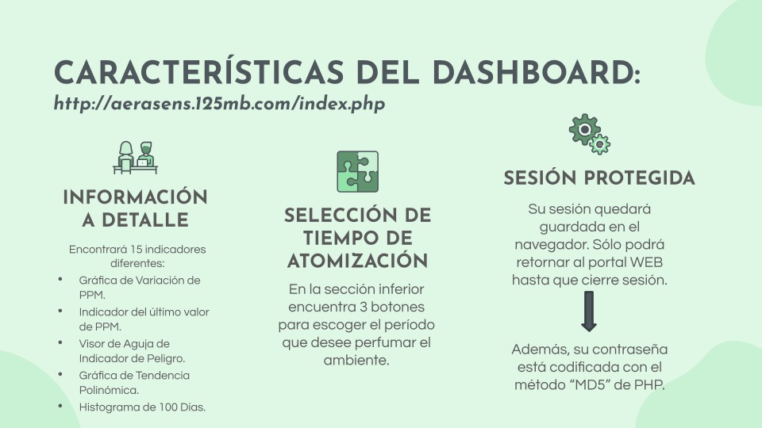
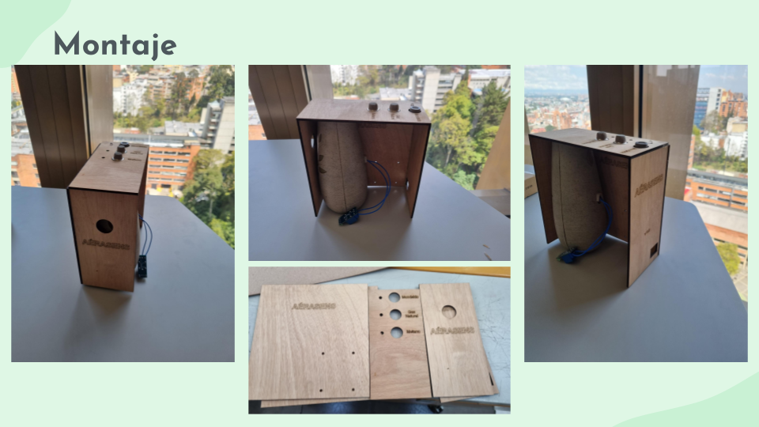
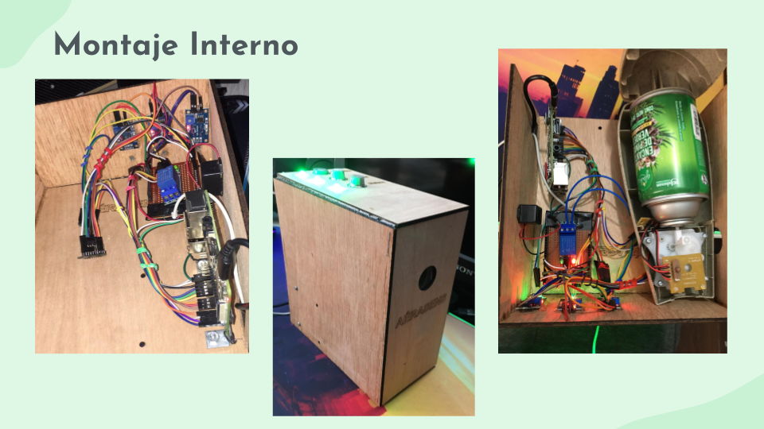

# Aérasense
## ACERCA DE NOSOTROS
Aérasens es un grupo de desarrollo de productos bajo la arquitectura IoT especializados en prevención de riesgos y alerta de presencia de gases en el ambiente.

Queremos que los servicios de gas domiciliarios ya no sean un problema de salud  ni un riesgo de calamidades domésticas para cada uno de nosotros. Respire tranquilo que Aérasens refresca su aire y está atento a su hogar.

## ¿ EN QUÉ CONSISTE NUESTRO PRODUCTO? 
* __UN AMBIENTADOR__: Enfocado en domótica que conectado a internet, permite configurar el período de atomización con aromas agradables.

* __UN SISTEMA INTELIGENTE__: Realiza funciones de sensado de gases tales como Gas Natural, Monóxido de Carbono y Gas Metano.

* __UNA PLATAFORMA__: Pues todos los datos de los sensores recopilados son llevados a la nube (ThingSpeak) para ser analizados y procesados, y luego representados en nuestra página web oficial.

* __UN "ALERTADOR"__: Si se detectan niveles de concentración altos, emitirá una alerta por medio de luces LED, el sonido de un Buzzer y un indicador en la Página, además de enviar alertas mediante Twitter.​

## Actuadores
* LEDs RGB   
Los LEDs RGB se han implementado para comunicar de manera visual la situación actual del aire en el ambiente en el que se encuentre cada uno de los sensores implementados. 
Haciendo uso de un solo LED por sensor, se puede evidenciar el estado del aire, teniendo en cuenta la siguiente convención:

    * Verde: Estado de oxígeno óptimo.​​
    * Amarillo: Estado de oxígeno precario.​​
    * Rojo: Estado de oxígeno crítico.
* Buzzer  
Para proporcionar una señal de forma auditiva se va a utilizar como actuador un buzzer.  

    El propósito de este buzzer es comunicar si alguno de los sensores que se encuentran analizando el ambiente, encuentra que el aire esta por encima de los parámetros permitidos de cada uno de los tipos de gases que se miden.

* Relay  
Partiendo de un ambientador que se encuentra en el hogar, se ha decidido otorgale algun tipo de inteligencia o control a este aparato.  

    El dispositivo que permite este control inteligente es el Relay, el cual nos permite controlar el accionamiento del ambientador por medio del dashboard del usuario.

    Además de proporcionar control sobre el aromatizador, el Relay también tiene la característica de aislar galvánicamente el circuito eléctrico del ambientador de nuestro dispositivo de control que es la raspberry
  
## Dashboard

  

## Montaje
### Exterior

  

### Interior

  

